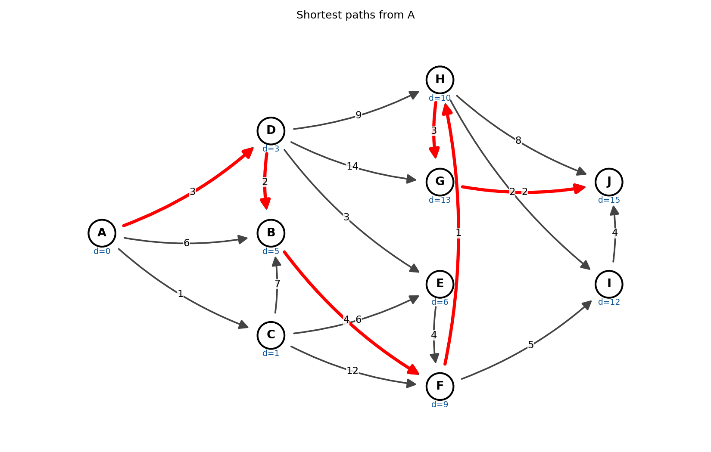
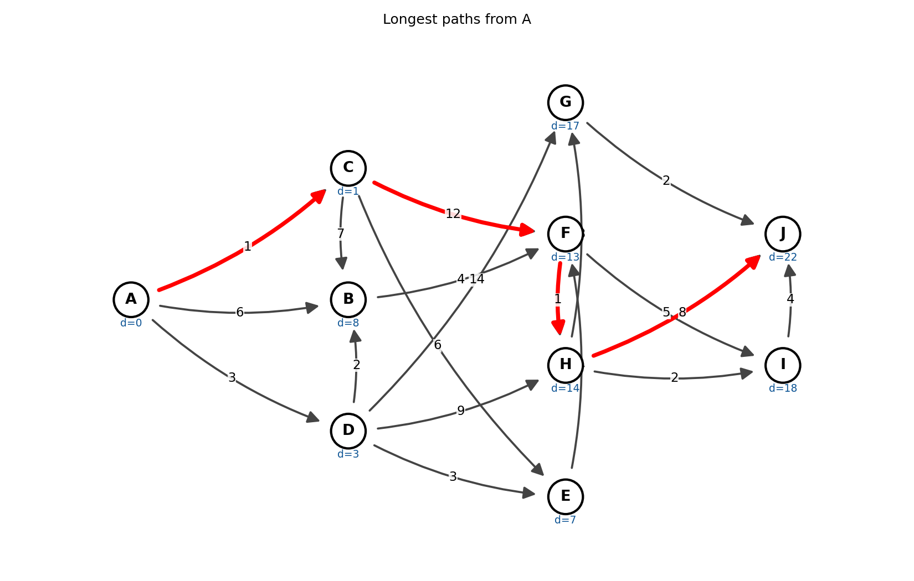

<div align="center">

# 🧭 Dijkstra's Algorithm Explorer

**Shortest path** (Dijkstra) and **longest path** search on weighted graphs

Type in a graph, pick two vertices, and watch the path appear - step by step.


<table>
<tr>
<td align="center"><b>Shortest path</b> (Dijkstra)<br></td>
<td align="center"><b>Longest path</b><br></td>
</tr>
</table>

</div>

---

## ✨ Features

| | |
|---|---|
| 🖥️ **Desktop app** | No code editing. Type edges, choose *From* / *To*, press **Calculate**. |
| 🎞️ **Step-by-step playback** | Slide through every stage; finalised vertices turn green, the current one orange. |
| 📋 **Classic exam table** | `Step \| Set L \| B \| C \| …` with `distance(predecessor)` cells - exportable to CSV. |
| 🔴 **Path highlighting** | Shortest (or longest) path drawn in red, live distance shown under each vertex. |
| ↔️ **Directed & undirected** | One checkbox switches between one-way and two-way edges. |
| 💾 **Open / save graphs** | Plain-text edge lists or JSON. Save the picture as PNG/SVG. |
| 📏 **Shortest & longest path** | *Find* → **Shortest path** (Dijkstra, default) or **Longest path**: exact answer on DAGs, exhaustive search on graphs with cycles. |
| ⌨️ **Command line** | Same engine, scriptable: `python main.py graph.txt -s A -e J --table`. |
| 🛡️ **Friendly validation** | Clear messages for bad lines, negative weights, unknown vertices, unreachable targets. |

## 🚀 Quick start

```bash
git clone https://github.com/Narothe/dijkstra-algorithm.git
cd dijkstra-algorithm
pip install -r requirements.txt
python main.py
```

The app opens with an example graph already loaded - just press **Calculate**.

> **Requirements:** Python 3.9+ with `tkinter` (bundled with the official Windows/macOS installers; on Debian/Ubuntu run `sudo apt install python3-tk`).

## 🖱️ Using the app

1. **Describe your graph** in the left panel, one edge per line: `FROM TO WEIGHT`

   ```text
   A B 6
   A C 1
   C B 7        # anything after # is ignored
   K            # a lone name adds an isolated vertex
   ```

   `A->B:6` and `A,B,6` work too. Weights may be decimals but not negative.
2. Tick or untick **Directed edges**.
3. Choose the **From** and **To** vertices.
4. Press **Calculate** (or `Ctrl+Enter`).
5. Use **◀ ▶** or the slider to replay the algorithm, **Show final** to jump back to the result.
6. **Export table (CSV)** and **Save image** to reuse the results in reports or homework.

## ⌨️ Command line

```bash
# shortest path (default, same as --shortest)
python main.py --demo --table -s A -e J
python main.py examples/demo.json -s A -e J
python main.py examples/campus.txt --undirected -s Library -e Parking --save docs/shortest_campus.png

# longest path
python main.py --demo --longest -s A -e J --table
python main.py examples/campus.txt --undirected --longest -s Library -e Parking --save docs/longest_campus.png

python main.py --gui                             # force the desktop app
```

| Option | Meaning |
|---|---|
| `graph` | `.json` or edge-list `.txt` file (omit to open the app) |
| `-s, --start` / `-e, --end` | start vertex / destination (prints path and cost) |
| `--undirected` | treat every edge as two-way |
| `--table` | print the step-by-step table |
| `--plot` / `--save FILE.png` | show / save the drawing |
| `--shortest` | find the **shortest** path with Dijkstra *(default)* |
| `--longest` | find the **longest** path instead |
| `--demo` | use the built-in example graph |

### Shortest path output - `--demo --table -s A -e J`

```text
Step | Set L                 | B    | C    | D    | E    | F     | G     | H     | I     | J
-------------------------------------------------------------------------------------------------
0    | {}                    | ∞    | ∞    | ∞    | ∞    | ∞     | ∞     | ∞     | ∞     | ∞
1    | {A}                   | 6(A) | 1(A) | 3(A) | ∞    | ∞     | ∞     | ∞     | ∞     | ∞
2    | {A,C}                 | 6(A) | 1(A) | 3(A) | 7(C) | 13(C) | ∞     | ∞     | ∞     | ∞
3    | {A,C,D}               | 5(D) | 1(A) | 3(A) | 6(D) | 13(C) | 17(D) | 12(D) | ∞     | ∞
…
10   | {A,B,C,D,E,F,G,H,I,J} | 5(D) | 1(A) | 3(A) | 6(D) | 9(B)  | 13(H) | 10(F) | 12(H) | 15(G)

Shortest path A -> J: A -> D -> B -> F -> H -> G -> J
Cost: 15
```

<details>
<summary>Longest path output - <code>--demo --longest -s A -e J</code></summary>

```text
Longest distances from A:
  A -> B: 8    A -> C: 1    A -> D: 3    A -> E: 7    A -> F: 13
  A -> G: 17   A -> H: 14   A -> I: 18   A -> J: 22

Longest path A -> J: A -> C -> F -> H -> J
Cost: 22
```
</details>

Reading a cell: `9(B)` means *"currently the best known distance is 9, reached via B"*; `∞` means *not reached yet*.

## 📏 Shortest vs. longest path

| | **Shortest path** | **Longest path** |
|---|---|---|
| App | *Find* → Shortest path | *Find* → Longest path |
| CLI | `--shortest` (default) | `--longest` |
| Module | `dijkstra_app/shortest.py` | `dijkstra_app/longest.py` |
| Function | `shortest_path()` (alias `dijkstra()`) | `longest_path()` |
| Weights | non-negative only | any |
| Difficulty | `O((V + E) log V)` | linear on a DAG, **NP-hard** in general |
| Tests | `tests/test_shortest.py` | `tests/test_longest.py` |
| Images | `docs/shortest_*.png` | `docs/longest_*.png` |

Longest path is a different problem from Dijkstra, so it has its own module and strategy:

| Graph | Method | Complexity |
|---|---|---|
| Directed, **no cycles** (DAG) | dynamic programming in topological order | `O(V + E)` |
| Has cycles (every undirected graph does) | exhaustive search of *simple* paths (no vertex visited twice) | exponential |

The longest path problem is **NP-hard** in general graphs, so the cyclic case is capped by a search budget;
on graphs that are too large you get a clear message instead of a frozen window.
Unreachable vertices are shown as `∞` ("not reachable"). Negative weights are allowed here.

```python
from dijkstra_app import longest_path

r = longest_path({"A": {"B": 3, "C": 2}, "B": {"C": 1}, "C": {}}, "A")
r.path_to("C"), r.distances["C"], r.method   # (['A', 'B', 'C'], 4, 'dag')
```

## 🐍 Use it as a library

```python
from dijkstra_app import shortest_path, longest_path, format_table

graph = {"A": {"B": 2, "C": 5}, "B": {"C": 1}, "C": {}}

shortest = shortest_path(graph, "A")
shortest.distances        # {'A': 0, 'B': 2, 'C': 3}
shortest.path_to("C")     # ['A', 'B', 'C']

longest = longest_path(graph, "A")
longest.distances["C"]    # 5
longest.path_to("C")      # ['A', 'C']

print(format_table(shortest, graph))
```

## 🗂️ Project layout

```text
main.py               entry point (app or CLI)
dijkstra_app/
├── core.py           shared: Graph/Result/Step types, validation, table formatting
├── shortest.py       SHORTEST path: Dijkstra's algorithm
├── longest.py        LONGEST path: DAG dynamic programming / simple-path search
├── graph_io.py       edge-list and JSON reading/writing
├── visualize.py      networkx + matplotlib drawing
├── gui.py            tkinter desktop app
└── cli.py            command-line interface
examples/             sample graphs (.json, .txt)
docs/                 shortest_*.png and longest_*.png illustrations
tests/
├── test_shortest.py  shortest-path tests
├── test_longest.py   longest-path tests
└── test_graph_io.py  graph parsing tests (shared)
```

## 🧪 Tests

```bash
python -m unittest discover -s tests -t .          # everything
python -m unittest tests.test_shortest             # shortest path only
python -m unittest tests.test_longest              # longest path only
```

## 📚 Good to know

- **Shortest path:** Dijkstra requires **non-negative** weights; the app rejects negative ones with an explanation. It uses a binary heap: `O((V + E) log V)`.
- **Longest path:** the stage table shows the best known length so far per vertex, in topological order (DAG) or as one final stage (cyclic search).
- In both modes, vertices unreachable from the start are shown as `∞` and never receive a path.

## 👤 Author

Made by [@Narothe](https://github.com/Narothe) as an educational aid for studying shortest paths in graphs.
